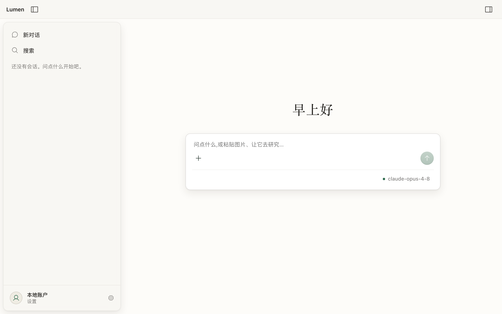

<div align="center">



# Lumen

**独立研究者的 AI 研究工作台** — 喂给它论文,它读完把报告写进你的工作区。

_A local-first AI research companion: feed it papers, get structured reports in a real workspace._

</div>

## 它做什么

- **研读文献**:上传 PDF,Lumen 提取、精读,在对话里和你讨论
- **产出报告**:解读、综述这类交付物直接写成工作区里的真实文件,不是埋在聊天记录里
- **三栏工作台**:会话列表 / 对话 / 工作区+阅读器,读与写互不打架
- **模型可插拔**:DeepSeek、Claude 或任意 OpenAI 兼容端点,界面里即可切换
- **本地优先**:数据(SQLite)和所有文件都在你自己的电脑上

## 快速开始(需 Node ≥ 22.6)

```bash
git clone https://github.com/luoziyan100/lumen.git
cd lumen
npm install
npm run dev        # 后端服务 + Web 界面一起启动
```

浏览器打开 **http://localhost:5173**,点左下角「设置」填入你的模型 API Key(支持 DeepSeek / Anthropic / OpenAI 兼容中转),开始研究。

> 也可以把 `packages/agent-service/.env.example` 复制为 `.env`,用环境变量配置。

## macOS 桌面版

Tauri 原生壳已可本地构建:`npm run tauri:build --workspace @lumen/ui-client`。
**可直接下载的自包含 .app(内置运行时 + 签名公证)在路上**,见路线图。

## 架构

```
packages/
  agent-service/   # 无头 agent 服务:内核循环 + 研究工具 + SQLite 存储 + WebSocket(Node)
  ui-client/       # 薄客户端:React + Vite;Tauri 原生壳(macOS)
```

内核只有一条铁律:**agent 是一条只增不减的消息线程上的循环,每个工具调用的结果必须回灌同一条线程**——模型永远看得见自己行为的后果。详见[架构文档](doc/agent-core-architecture.md)。

## 路线图

- [x] agent 内核 / 工具 / 存储 / WS 协议
- [x] PDF 研读与报告产物
- [x] 会话恢复、上传暂存、工作区阅读器
- [ ] 上下文水位与超窗软着陆
- [ ] 自包含 macOS .app(内置运行时 + 公证),下载即用
- [ ] 更多研究工具(文献检索、引文管理)

## License

[MIT](LICENSE)
