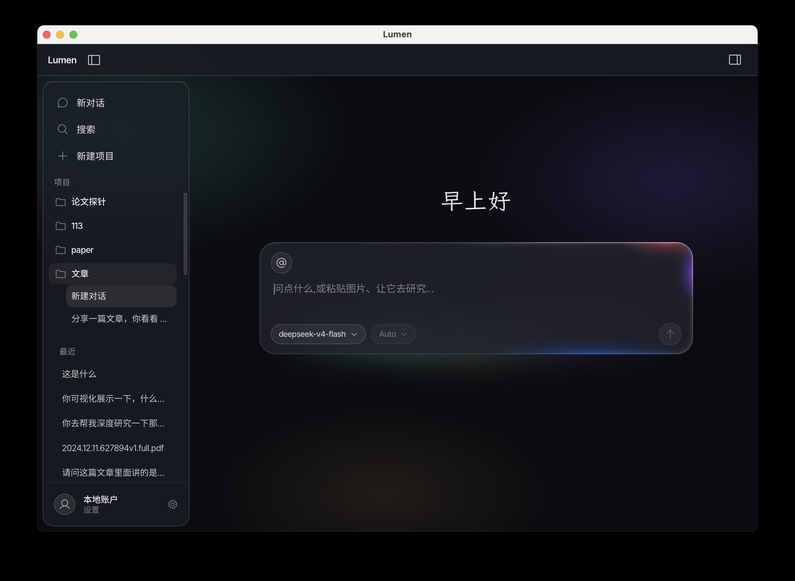

<div align="center">



# Lumen

**个人 AI 工作台** — 本机上的办公搭档(Co-Worker):聊天只是操作面,活儿落在真实工作区文件里。

_A local-first personal workbench: your on-device co-worker for everyday office work, with files as the durable output._

</div>

## 它做什么

### 工作与交付

- **一等项目**:侧栏按项目组织多会话;资料可进项目共享区,聊天互不串;可挂本机源文件夹只读浏览
- **文件即交付**:报告、笔记、草稿写进真实工作区,不是埋在聊天气泡里;内置 PDF 阅读器
- **上传暂存**:文件先停在输入区,发送时才建会话、才入工作区
- **跨会话记忆**:项目级 `memory/` + 索引开局注入,下一次开聊仍记得约定
- **Todo 进度**:复杂任务用 `todo_write` 写出步骤,右轨 Progress / TodoCard 跟踪(见 `doc/todo.md`)
- **问用户**:关键选择挂起作答(`ask_user`),不必猜你的偏好
- **富输出**:对话内网页沙箱 widget、Mermaid 流程图等,读与写互不打架

### 模型与可靠

- **模型可插拔**:DeepSeek / Claude / 任意 OpenAI 兼容端点,界面里切换
- **识图**:粘贴或上传图片;DeepSeek 路径经侧车识图工具,主模型仍走文本工具环
- **上下文管理**:水位提示、大结果落盘、确定性压缩、超窗软着陆——长任务不易一头撞死
- **本地优先**:SQLite + 工作区文件都在你电脑上;断线可恢复、会话可续跑

## 快速开始

当前以 **Web 开发模式** 运行:需要本机先装好 Node,再 clone 启动。自包含 DMG(下载即用)仍在路上。

### 1. 准备 Node 环境

需要 **Node.js ≥ 22.6**(自带 npm)。终端执行 `node -v` 确认版本。

macOS 推荐用官方安装包或包管理器任选其一:

```bash
# 方式 A: Homebrew
brew install node@22

# 方式 B: nvm(便于多版本共存)
curl -o- https://raw.githubusercontent.com/nvm-sh/nvm/v0.40.1/install.sh | bash
# 重开终端后:
nvm install 22
nvm use 22
```

Windows / Linux 可从 [nodejs.org](https://nodejs.org/) 安装 LTS(选 22.x 及以上)。

### 2. 安装并启动

```bash
git clone https://github.com/luoziyan100/lumen.git
cd lumen
npm install
npm run dev        # 同时启动 agent-service + Web 界面
```

### 3. 打开并配置模型

浏览器打开 **http://localhost:5180**,点左下角「设置」,填入你的模型 API Key(支持 DeepSeek / Anthropic / OpenAI 兼容中转),即可开始工作。

> 也可以把 `packages/agent-service/.env.example` 复制为 `.env`,用环境变量预填 Key / 端口等。

## macOS 桌面版

Tauri 原生壳已可本地构建:`npm run tauri:build --workspace @lumen/ui-client`(仍需本机 Node 与仓库路径,不是给陌生人用的安装包)。
**可直接下载的自包含 .app / .dmg(内置运行时 + 签名公证)在路上**,见路线图。

## 架构

```
packages/
  agent-service/   # 无头 agent 服务:内核循环 + 工具 + SQLite 存储 + WebSocket(Node)
  ui-client/       # 薄客户端:React + Vite;Tauri 原生壳(macOS)
```

内核只有一条铁律:**agent 是一条只增不减的消息线程上的循环,每个工具调用的结果必须回灌同一条线程**——模型永远看得见自己行为的后果。详见[架构文档](doc/agent-core-architecture.md)。

## 路线图

- [x] agent 内核 / 工具 / 存储 / WS 协议
- [x] 工作区文件产物、PDF 阅读与报告
- [x] 会话恢复、上传暂存、工作区阅读器
- [x] 一等项目(侧栏树 + 项目级共享区)
- [x] 上下文水位与超窗软着陆
- [x] 跨会话记忆 / 计划卡 / 问用户
- [ ] 自包含 macOS .app(内置运行时 + 公证),下载即用
- [ ] 办公场景工具与工作流加深

## License

[MIT](LICENSE)
